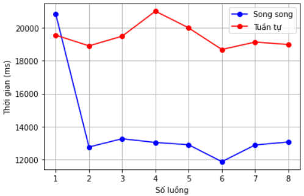

# Parallel Computing
There are 3 parts in this class.

## Part 1: OpenMP
In this part, I used C/C++ with the libary called "omp.h". I learned how to design parallel algorithms and applied it to some simple problems like pi calculation, fibonacci, matrix multiplication, ...

## Part 2: Grid Computing - Alchemi
My lecturer taught me to create a grid using Alchemi - a middleware base on dotnet framework and of course, you can only run it on Windows. Although it is quite outdated, but I think I've had some based knowledge about grid computing.

You can install Alchemi in [here](https://sourceforge.net/projects/alchemi/). After installed, you need to create a project with a 2.0 dotnet framework cause it isn't supported by higher version of dotnet framework. Then you find the Alchemi.Core.dll file and add it to your project. Finally, build your own grid.

In my Alchemi project, because of low version dotnet framework so i cannot use ```BigInteger``` in ```System.Numerics```. I used [this](https://www.codeproject.com/Articles/36323/BigInt) instead to compute with big numbers.

## Part 3: Implemented parallel version of breadth-first search
In this project I was following the paper [A work-efficient parallel breadth-first search algorithm
(or how to cope with the nondeterminism of reducers)
](https://dspace.mit.edu/bitstream/handle/1721.1/100925/Leiserson_A%20work-efficient.pdf?sequence=1&isAllowed=y) and with the help in coding of this [repository](https://github.com/nducthang/BFSParallel).

I randomly generated a graph dataset with 1 million vertices and 1,811,697 edges. Not as expected, the performance in my implementation is just slightly improved.
<p align="center">
  
</p>
